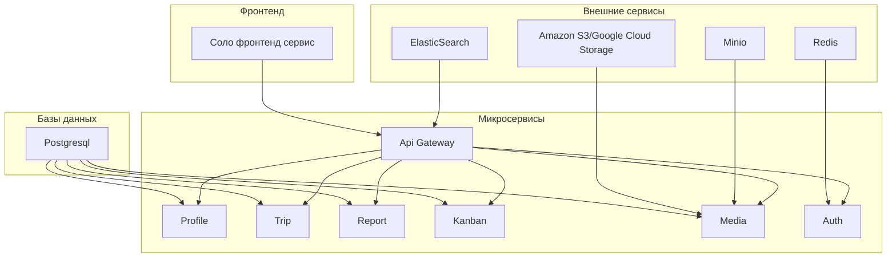
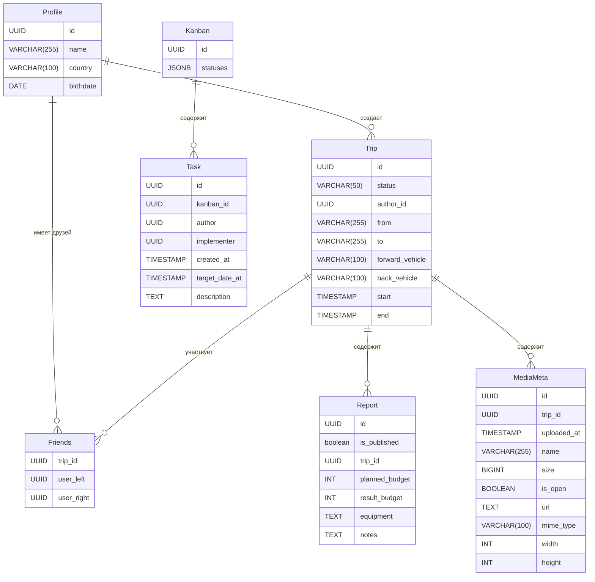

# Основные компоненты системы:

## Список микросервисов:

<b>Служебные:</b>

- Api Gateway
- Config
- Monitor Dashboard
- Service Discovery
- Log Analysis
- Auth

<b>Функциональные:</b>

- Profile
- Trip
- Report
- Media
- Kanban

## Фронтенд:

<b>Соло фронтенд сервис</b>

## Базы данных и сопутствующие технологии:

<b>Postgresql</b>

<h4>Profile</h4>
<table>
  <thead>
    <tr>
      <th>Столбец</th>
      <th>Тип данных</th>
      <th>Ограничения</th>
      <th>Описание</th>
    </tr>
  </thead>
  <tbody>
    <tr>
      <td><code>id</code></td>
      <td><code>UUID</code></td>
      <td>PRIMARY KEY</td>
      <td>Уникальный идентификатор</td>
    </tr>
    <tr>
      <td><code>name</code></td>
      <td><code>VARCHAR(255)</code></td>
      <td>NOT NULL</td>
      <td>Имя пользователя</td>
    </tr>
    <tr>
      <td><code>country</code></td>
      <td><code>VARCHAR(100)</code></td>
      <td></td>
      <td>Страна</td>
    </tr>
    <tr>
      <td><code>birthdate</code></td>
      <td><code>DATE</code></td>
      <td></td>
      <td>Дата рождения</td>
    </tr>
  </tbody>
</table>

<h4>Friends</h4>
<table>
  <thead>
    <tr>
      <th>Столбец</th>
      <th>Тип данных</th>
      <th>Ограничения</th>
      <th>Описание</th>
    </tr>
  </thead>
  <tbody>
    <tr>
      <td><code>trip_id</code></td>
      <td><code>UUID</code></td>
      <td>FOREIGN KEY (<code>Trip.id</code>)</td>
      <td>ID путешествия</td>
    </tr>
    <tr>
      <td><code>user_left</code></td>
      <td><code>UUID</code></td>
      <td>FOREIGN KEY (<code>Profile.id</code>)</td>
      <td>ID первого пользователя</td>
    </tr>
    <tr>
      <td><code>user_right</code></td>
      <td><code>UUID</code></td>
      <td>FOREIGN KEY (<code>Profile.id</code>)</td>
      <td>ID второго пользователя</td>
    </tr>
  </tbody>
</table>

<h4>Trip</h4>
<table>
  <thead>
    <tr>
      <th>Столбец</th>
      <th>Тип данных</th>
      <th>Ограничения</th>
      <th>Описание</th>
    </tr>
  </thead>
  <tbody>
    <tr>
      <td><code>id</code></td>
      <td><code>UUID</code></td>
      <td>PRIMARY KEY</td>
      <td>Уникальный идентификатор</td>
    </tr>
    <tr>
      <td><code>status</code></td>
      <td><code>VARCHAR(50)</code></td>
      <td>NOT NULL</td>
      <td>Статус путешествия</td>
    </tr>
    <tr>
      <td><code>author_id</code></td>
      <td><code>UUID</code></td>
      <td>FOREIGN KEY (<code>Profile.id</code>)</td>
      <td>ID первого пользователя</td>
    </tr>
    <tr>
      <td><code>from</code></td>
      <td><code>VARCHAR(255)</code></td>
      <td>NOT NULL</td>
      <td>Начальная точка</td>
    </tr>
    <tr>
      <td><code>to</code></td>
      <td><code>VARCHAR(255)</code></td>
      <td>NOT NULL</td>
      <td>Конечная точка</td>
    </tr>
    <tr>
      <td><code>forward_vehicle</code></td>
      <td><code>VARCHAR(100)</code></td>
      <td></td>
      <td>Транспорт туда</td>
    </tr>
    <tr>
      <td><code>back_vehicle</code></td>
      <td><code>VARCHAR(100)</code></td>
      <td></td>
      <td>Транспорт обратно</td>
    </tr>
    <tr>
      <td><code>start</code></td>
      <td><code>TIMESTAMP</code></td>
      <td>NOT NULL</td>
      <td>Дата начала</td>
    </tr>
    <tr>
      <td><code>end</code></td>
      <td><code>TIMESTAMP</code></td>
      <td>NOT NULL</td>
      <td>Дата окончания</td>
    </tr>
  </tbody>
</table>

<h4>Report</h4>
<table>
  <thead>
    <tr>
      <th>Столбец</th>
      <th>Тип данных</th>
      <th>Ограничения</th>
      <th>Описание</th>
    </tr>
  </thead>
  <tbody>
    <tr>
      <td><code>id</code></td>
      <td><code>UUID</code></td>
      <td>PRIMARY KEY</td>
      <td>Уникальный идентификатор</td>
    </tr>
    <tr>
      <td><code>is_published</code></td>
      <td><code>boolean</code></td>
      <td></td>
      <td>Флаг публикации</td>
    </tr>
    <tr>
      <td><code>trip_id</code></td>
      <td><code>UUID</code></td>
      <td>FOREIGN KEY (<code>Trip.id</code>)</td>
      <td>ID путешествия</td>
    </tr>
    <tr>
      <td><code>planned_budget</code></td>
      <td><code>DECIMAL(10, 2)</code></td>
      <td></td>
      <td>Планируемый бюджет</td>
    </tr>
    <tr>
      <td><code>result_budget</code></td>
      <td><code>DECIMAL(10, 2)</code></td>
      <td></td>
      <td>Фактический бюджет</td>
    </tr>
    <tr>
      <td><code>equipment</code></td>
      <td><code>TEXT</code></td>
      <td></td>
      <td>Снаряжение</td>
    </tr>
    <tr>
      <td><code>notes</code></td>
      <td><code>TEXT</code></td>
      <td></td>
      <td>Заметки</td>
    </tr>
  </tbody>
</table>

<h4>Kanban</h4>
<table>
  <thead>
    <tr>
      <th>Столбец</th>
      <th>Тип данных</th>
      <th>Ограничения</th>
      <th>Описание</th>
    </tr>
  </thead>
  <tbody>
    <tr>
      <td><code>id</code></td>
      <td><code>UUID</code></td>
      <td>PRIMARY KEY</td>
      <td>Уникальный идентификатор</td>
    </tr>
    <tr>
      <td><code>statuses</code></td>
      <td><code>JSONB</code></td>
      <td></td>
      <td>Статусы задач</td>
    </tr>
  </tbody>
</table>

<h4>Task</h4>
<table>
  <thead>
    <tr>
      <th>Столбец</th>
      <th>Тип данных</th>
      <th>Ограничения</th>
      <th>Описание</th>
    </tr>
  </thead>
  <tbody>
    <tr>
      <td><code>id</code></td>
      <td><code>UUID</code></td>
      <td>PRIMARY KEY</td>
      <td>Уникальный идентификатор</td>
    </tr>
    <tr>
      <td><code>kanban_id</code></td>
      <td><code>UUID</code></td>
      <td>FOREIGN KEY (<code>Kanban.id</code>)</td>
      <td>ID канбан-доски</td>
    </tr>
    <tr>
      <td><code>author</code></td>
      <td><code>UUID</code></td>
      <td>FOREIGN KEY (<code>Profile.id</code>)</td>
      <td>ID автора задачи</td>
    </tr>
    <tr>
      <td><code>implementer</code></td>
      <td><code>UUID</code></td>
      <td>FOREIGN KEY (<code>Profile.id</code>)</td>
      <td>ID исполнителя задачи</td>
    </tr>
    <tr>
      <td><code>created_at</code></td>
      <td><code>TIMESTAMP</code></td>
      <td>NOT NULL</td>
      <td>Дата создания задачи</td>
    </tr>
    <tr>
      <td><code>target_date_at</code></td>
      <td><code>TIMESTAMP</code></td>
      <td></td>
      <td>Планируемая дата выполнения</td>
    </tr>
    <tr>
      <td><code>description</code></td>
      <td><code>TEXT</code></td>
      <td></td>
      <td>Описание задачи</td>
    </tr>
  </tbody>
</table>

<h4>MediaMeta</h4>
<table>
  <thead>
    <tr>
      <th>Столбец</th>
      <th>Тип данных</th>
      <th>Ограничения</th>
      <th>Описание</th>
    </tr>
  </thead>
  <tbody>
    <tr>
      <td><code>id</code></td>
      <td><code>UUID</code></td>
      <td>PRIMARY KEY</td>
      <td>Уникальный идентификатор</td>
    </tr>
    <tr>
      <td><code>trip_id</code></td>
      <td><code>UUID</code></td>
      <td>FOREIGN KEY (<code>Trip.id</code>)</td>
      <td>ID путешествия</td>
    </tr>
    <tr>
      <td><code>uploaded_at</code></td>
      <td><code>TIMESTAMP</code></td>
      <td>NOT NULL</td>
      <td>Дата загрузки</td>
    </tr>
    <tr>
      <td><code>name</code></td>
      <td><code>VARCHAR(255)</code></td>
      <td>NOT NULL</td>
      <td>Имя файла</td>
    </tr>
    <tr>
      <td><code>size</code></td>
      <td><code>BIGINT</code></td>
      <td>NOT NULL</td>
      <td>Размер файла (в байтах)</td>
    </tr>
    <tr>
      <td><code>is_open</code></td>
      <td><code>BOOLEAN</code></td>
      <td>DEFAULT FALSE</td>
      <td>Доступен ли файл</td>
    </tr>
    <tr>
      <td><code>url</code></td>
      <td><code>TEXT</code></td>
      <td>NOT NULL</td>
      <td>Ссылка на файл</td>
    </tr>
    <tr>
      <td><code>mime_type</code></td>
      <td><code>VARCHAR(100)</code></td>
      <td>NOT NULL</td>
      <td>MIME-тип файла</td>
    </tr>
    <tr>
      <td><code>width</code></td>
      <td><code>INT</code></td>
      <td></td>
      <td>Ширина (для изображений)</td>
    </tr>
    <tr>
      <td><code>height</code></td>
      <td><code>INT</code></td>
      <td></td>
      <td>Высота (для изображений)</td>
    </tr>
  </tbody>
</table>

<b>Кэши сервиса авторизации:</b>

- Redis

<b>Хранение файлов</b>

- Amazon S3/Google Cloud Storage
- minio

<b>Оптимизированный поиск</b>

- ElasticSearch

## Брокер сообщений (в потенциале):

Ограничусь RabbitMQ

# Описание функциональных микросервисов:

## Profile:

<b>Таблицы БД задействованные в сервисе:</b>

- Profile

<b>Операции в сервисе:</b>

- Создание профиля (таблица Profile)
- Получение списка профилей (таблица Profile)
- Получение данных профиля (таблица Profile)
- Обновление данных профиля (таблица Profile)
- Удаление профиля (таблица Profile)

## Trip

<b>Таблицы БД задействованные в сервисе:</b>

- Trip
- Friends

<b>Операции в сервисе:</b>

- Создание путешествия (таблица Trip)
- Получение списка путешествий (таблица Friends)
- Получение данных путешествия (таблица Trip)
- Обновление данных путешествия (таблица Trip)
- Удаление путешествия (таблица Trip)
- Добавление друга (таблица Friends)
- Получение списка друзей (таблица Friends)
- Удаление друга (таблица Friends)

## Report

<b>Таблицы БД задействованные в сервисе:</b>

- Report

<b>Операции в сервисе:</b>

- Создание отчета (таблица Report)
- Получение данных отчета (таблица Report)
- Обновление данных отчета (таблица Report)
- Удаление отчета (таблица Report)

## Kanban

<b>Таблицы БД задействованные в сервисе:</b>

- Kanban
- Task

<b>Операции в сервисе:</b>

- Создание доски (таблица Kanban)
- Получение данных доски (таблица Kanban)
- Обновление данных доски (таблица Kanban)
- Удаление доски (таблица Kanban)
- Создание задачи (таблица Task)
- Получение списка задач (таблица Task)
- Получение данных задачи (таблица Task)
- Обновление данных задачи (таблица Task)
- Удаление задачи (таблица Task)

## Media

<b>Таблицы БД задействованные в сервисе:</b>

- MediaMeta

<b>Облачные хранилища задействованные в сервисе:</b>

- Minio
- Amazon S3/Google Cloud Storage

<b>Операции в сервисе:</b>

- Создание изображения (таблица MediaMeta)
- Удаление изображения (таблица MediaMeta)

# Диаграммы:

## Диаграмма компонентов

## ER-диаграмма

